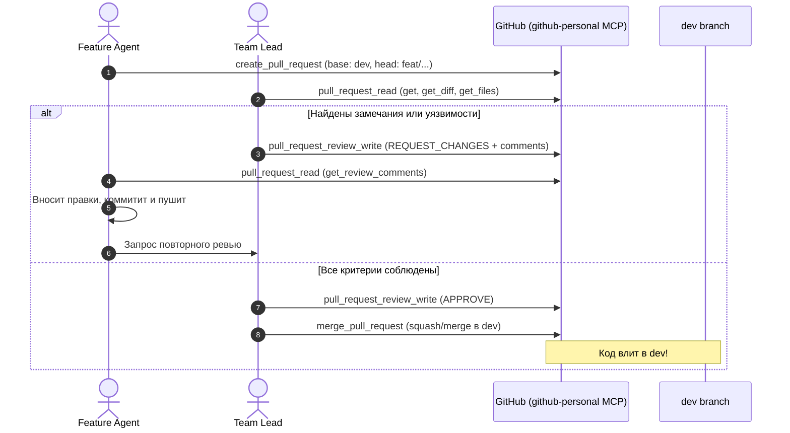

# Команда разработки AndroMac (Bridge)

Документ описывает структуру команды специализированных ИИ-агентов, их зоны ответственности, правила ветвления, процесс коммитов, код-ревью и слияния через GitHub MCP (`github-personal`), а также правила работы с документацией через Context7.

---

## 1. Состав команды и роли

| Роль | Имя агента (`.claude/agents/`) | Зона ответственности | Стек / Технологии | Директории |
| :--- | :--- | :--- | :--- | :--- |
| **Team Lead & Architect** | `team-lead` | Архитектурный контроль, код-ревью PR, апрув и мерж в `dev`, координация | Flutter, Dart, Swift, Kotlin, Security | Корневой уровень, `docs/` |
| **Core & Protocol Engineer** | `core-protocol` | Сетевой транспорт, mTLS, mDNS, JSON-протокол, криптография, хранение | Dart, WebSockets, mTLS, Drift, SQLCipher | `packages/bridge_protocol`, `packages/bridge_crypto`, `packages/bridge_transport`, `packages/bridge_core` |
| **Android Native Engineer** | `android-native` | Фоновые сервисы, NLS, SMS, буфер, перехват событий, Pigeon | Kotlin, Android SDK 10–15, Coroutines, Pigeon | `apps/phone/android`, `packages/bridge_platform` |
| **macOS Native Engineer** | `macos-native` | Меню-бар, буфер, нотификации, сон/пробуждение, VideoToolbox | Swift 5/6, AppKit, UserNotifications, Pigeon | `apps/desktop/macos`, `packages/bridge_platform` |
| **Flutter UI & Features** | `ui-features` | Виджеты, дизайн-система, Riverpod, модули фич (BridgeFeature), UI экраны | Flutter, Riverpod, go_router, intl | `packages/bridge_ui`, `packages/features/*`, `apps/*/lib` |
| **QA & Emulation Engineer** | `qa-tester` | CLI-эмуляторы (fake_phone, fake_mac), контрактные и golden-тесты, хаос-тесты | Dart CLI, mocktail, integration_test | `tools/fake_phone`, `tools/fake_mac`, `test/` |

---

## 2. Процесс разработки (Development Lifecycle)

### 2.1 Ветвление
- Основная ветка разработки: **`dev`**
- Релизная ветка: **`main`**
- Каждый агент работает **строго в своей отдельной ветке**, созданной от актуальной `dev`:
  ```bash
  git checkout dev
  git pull origin dev
  git checkout -b <тип>/<название-задачи>-<роль>
  ```
  Примеры имен веток:
  - `feat/wire-protocol-envelope-core`
  - `feat/notification-listener-service-android`
  - `feat/menu-bar-tray-popover-macos`
  - `feat/qr-pairing-screen-ui`
  - `feat/synthetic-phone-emulator-qa`
  - `fix/reconnect-backoff-core`

### 2.2 Коммиты и пуши
- Агенты фиксируют каждый этап работы атомарными коммитами по стандарту **Conventional Commits**:
  - `feat:` — новая функциональность
  - `fix:` — исправление бага
  - `test:` — добавление или правка тестов
  - `refactor:` — рефакторинг без изменения поведения
  - `docs:` — документация
- Трейлер соавторства обязателен:
  ```text
  Co-Authored-By: Claude Code <noreply@anthropic.com>
  ```
- Регулярный пуш в удаленный репозиторий:
  ```bash
  git push -u origin <имя-ветки>
  ```

### 2.3 Использование Context7 для актуальной документации
Перед написанием кода с использованием внешних пакетов или платформенных API агент обращается к Context7 MCP:
1. Резолв идентификатора библиотеки:
   `mcp__context7__resolve-library-id(libraryName: "Riverpod", query: "Riverpod 2 code generation state management")`
2. Запрос документации и сниппетов:
   `mcp__context7__query-docs(libraryId: "/rrousselgit/riverpod", query: "NotifierProvider syntax and code generation")`

---

## 3. Процесс Pull Request и Код-ревью (GitHub MCP `github-personal`)



### 3.1 Создание PR (Feature Agent)
Агент создает Pull Request в ветку `dev`:
```json
{
  "tool": "mcp__github-personal__create_pull_request",
  "parameters": {
    "owner": "culcat",
    "repo": "AndroMac",
    "base": "dev",
    "head": "feat/notification-listener-android",
    "title": "feat(android): implement NotificationListenerService and RemoteInput replies",
    "body": "## Описание изменений\n- Добавлен сервис перехвата уведомлений...\n- Реализован ответ через RemoteInput...\n## Тестирование\n- Инструментальные тесты проверены."
  }
}
```

### 3.2 Код-ревью (Team Lead)
Team Lead проверяет PR:
1. Чтение изменений:
   `mcp__github-personal__pull_request_read(owner: "culcat", repo: "AndroMac", pullNumber: N, method: "get_diff")`
2. Чек-лист проверки:
   - [ ] Целевая ветка — `dev`
   - [ ] Нет логирования чувствительных данных (SMS, буфер, текст нотификаций)
   - [ ] Обработка сетевых разрывов и исключений
   - [ ] Соответствие ADR и архитектурным слоям
   - [ ] Наличие и прохождение тестов
3. Отправка ревью:
   - Если нужны правки: `pull_request_review_write` с `event: "REQUEST_CHANGES"`.
   - Если все чисто: `pull_request_review_write` с `event: "APPROVE"`.

### 3.3 Слияние (Team Lead)
После апрува Team Lead выполняет слияние:
```json
{
  "tool": "mcp__github-personal__merge_pull_request",
  "parameters": {
    "owner": "culcat",
    "repo": "AndroMac",
    "pullNumber": N,
    "merge_method": "squash",
    "commit_title": "feat(android): notification listener and remote input (#N)"
  }
}
```

---

## 4. Незыблемые правила безопасности
1. **Никакого открытого логирования PII:** Тексты сообщений, контакты, коды 2FA/OTP и содержимое буфера обмена **запрещено** выводить в `logcat`, `NSLog`, `print()` или файлы журналов.
2. **Только mTLS:** Запрещены незащищенные HTTP/WS соединения или прием соединений от неавторизованных пиров после завершения пейринга.
3. **Платформенные ограничения Android:** Учитывать запрет на фоновое чтение буфера на Android 10+ — захват только по явному действию пользователя.
