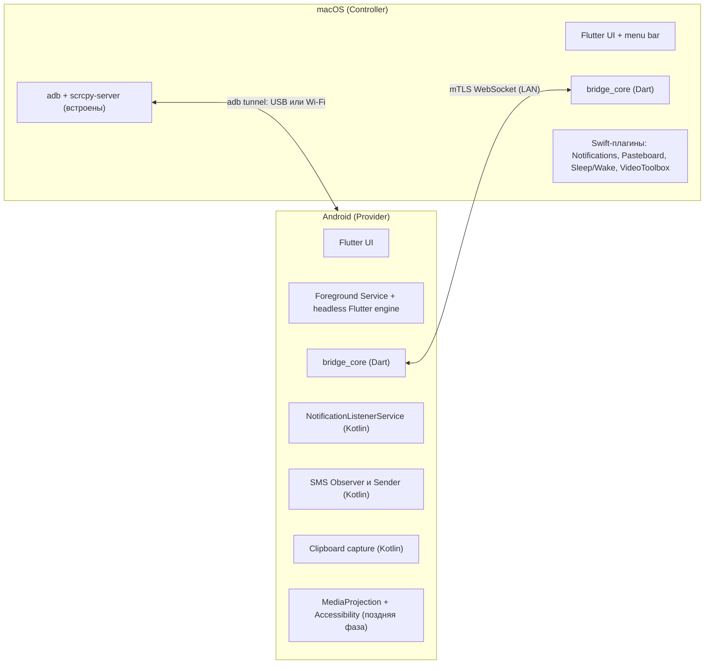
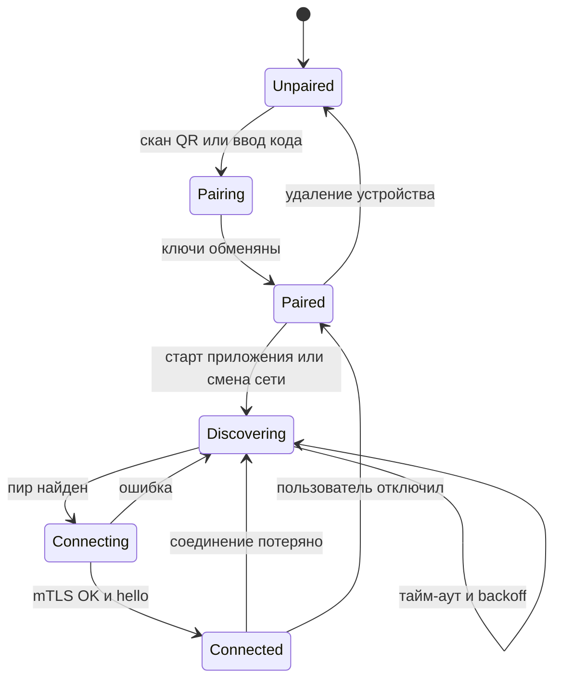
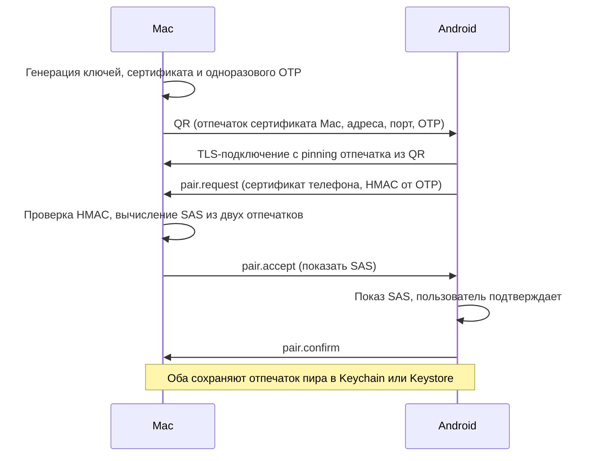
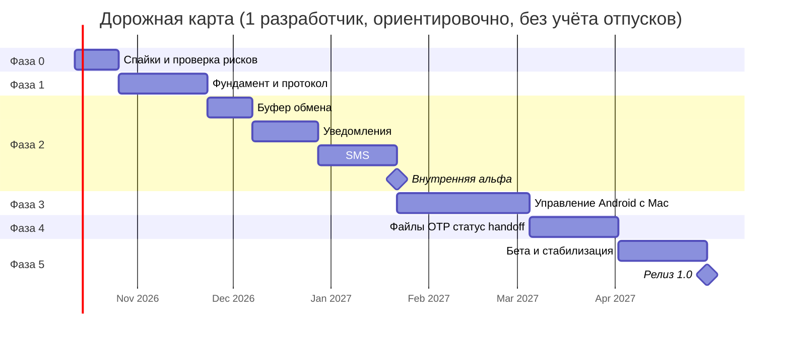

# AndroMac — план разработки приложения Mac ⇄ Android

> **Рабочее название:** AndroMac
> **Версия документа:** 0.1 · **Дата:** 9 октября 2026
> **Стек:** Flutter (Dart) + нативные модули Kotlin (Android) и Swift (macOS)
> **Статус:** черновик для обсуждения и уточнения

---

## Оглавление

0. [Краткое резюме](#0-краткое-резюме-tldr)
1. [Видение, цели, нецели](#1-видение-цели-нецели)
2. [Рынок и конкуренты](#2-рынок-и-конкуренты)
3. [Объём работ и приоритеты](#3-объём-работ-и-приоритеты)
4. [Reality-check: ограничения платформ](#4-reality-check-ограничения-платформ)
5. [Архитектура](#5-архитектура)
6. [Технологический стек](#6-технологический-стек)
7. [Структура репозитория и процесс разработки](#7-структура-репозитория-и-процесс-разработки)
8. [Детальное описание фич](#8-детальное-описание-фич)
9. [Безопасность и приватность](#9-безопасность-и-приватность)
10. [UX/UI](#10-uxui)
11. [Нефункциональные требования](#11-нефункциональные-требования)
12. [Тестирование и QA](#12-тестирование-и-qa)
13. [Сборка, дистрибуция, юридические вопросы](#13-сборка-дистрибуция-юридические-вопросы)
14. [Дорожная карта по фазам](#14-дорожная-карта-по-фазам)
15. [Реестр рисков](#15-реестр-рисков)
16. [Архитектурные решения (ADR) и открытые вопросы](#16-архитектурные-решения-adr-и-открытые-вопросы)
17. [Первые две недели: конкретные шаги](#17-первые-две-недели-конкретные-шаги)
18. [Приложения](#18-приложения)

---

## 0. Краткое резюме (TL;DR)

**Что делаем.** Пару приложений — для macOS и Android — которые воспроизводят опыт «iPhone + Mac» для связки **Android + Mac**: общий буфер обмена, зеркалирование уведомлений, SMS на Mac, управление Android с Mac, плюс дополнительные фичи (передача файлов, OTP-коды, статус телефона, звонки и т. д.).

**Как.** Единая кодовая база на Flutter: протокол, криптография, бизнес-логика и значительная часть UI. Тонкий слой нативного кода (Kotlin / Swift) — там, где Flutter не достаёт до системных API (NotificationListenerService, SMS, меню-бар, VideoToolbox и т. п.).

**Принципы продукта.**

- **Local-first:** данные идут напрямую между устройствами, без облака и аккаунтов.
- **Privacy-first:** сквозное шифрование, минимум разрешений, ничего не логируется в открытом виде.
- **Zero-config:** сканируешь QR — и всё работает.
- **Честность:** там, где платформа не позволяет (RCS, фоновый буфер обмена), мы говорим об этом пользователю прямо и даём лучший доступный обходной путь.

### Ключевые предлагаемые решения

| #   | Решение                        | Рекомендация                                                                         |
| --- | ------------------------------ | ------------------------------------------------------------------------------------ |
| 1   | Транспорт в локальной сети     | mTLS + WebSocket, pinning сертификатов после пейринга через QR                       |
| 2   | Обнаружение устройств          | mDNS/Bonjour + запасные варианты: ручной ввод IP и QR                                |
| 3   | Управление Android с Mac (MVP) | Обёртка над `adb` + `scrcpy-server`, затем собственный клиент                        |
| 4   | Фон на Android                 | Foreground Service (+ NotificationListenerService как «якорь»)                       |
| 5   | Дистрибуция на старте          | macOS: Developer ID вне Mac App Store; Android: прямой APK + облегчённая Play-версия |
| 6   | Состояние и архитектура        | Riverpod, drift (SQLite), Pigeon для нативных каналов, monorepo                      |

### Что нужно знать сразу

1. **Google Play жёстко ограничивает** разрешения SMS/Call Log и Accessibility. Полнофункциональная версия, скорее всего, будет распространяться вне Play (см. §4.3, §13).
2. **Фоновое чтение буфера обмена на Android 10+ запрещено.** Автоматически работает Mac → Android; Android → Mac потребует «триггера» (share-sheet, плитка, кнопка в уведомлении) (см. §4.2).
3. **RCS нельзя читать и отправлять через публичные API.** Это только SMS/MMS. Для RCS и мессенджеров есть обходной путь: ответ через `RemoteInput` в уведомлении (см. §8, F3).
4. **Управление экраном без adb** (через MediaProjection + Accessibility) сильно ограничено, поэтому для MVP берём adb/scrcpy-путь (см. §4.5).
5. **Нативного кода будет больше, чем кажется:** Flutter даёт общий UI и логику, но ключевые функции — это Kotlin и Swift.

## 1. Видение, цели, нецели

### 1.1 Видение

Пользователь Mac с телефоном на Android должен получить то же ощущение «единой экосистемы», что и владелец iPhone: телефон «растворяется» в Mac. Скопировал на телефоне — вставил на Mac; пришло уведомление — увидел и ответил на Mac; пришёл SMS с кодом — код уже в буфере; нужно что-то сделать на телефоне — открыл его экран в окне на Mac.

### 1.2 Цели (Goals)

| ID  | Цель                                                     | Измеримый критерий                                           |
| --- | -------------------------------------------------------- | ------------------------------------------------------------ |
| G1  | Надёжная автоматическая связь Mac ↔ Android в одной сети | Автопереподключение ≤ 5 с после смены сети / пробуждения Mac |
| G2  | Мгновенная синхронизация буфера обмена                   | p95 доставки текста ≤ 500 мс (LAN)                           |
| G3  | Зеркалирование уведомлений с действиями (ответ, закрыть) | p95 ≤ 1 с; закрытие синхронизируется в обе стороны           |
| G4  | Полноценная работа с SMS с Mac                           | Чтение истории, получение, отправка, поиск                   |
| G5  | Управление экраном Android с Mac                         | Задержка ≤ 100 мс по USB и ≤ 200 мс по Wi-Fi при 30–60 fps   |
| G6  | Простая и безопасная настройка                           | Пейринг ≤ 60 с, не требует аккаунта                          |
| G7  | Минимальное влияние на батарею и ресурсы                 | ≤ 3 % батареи в сутки на телефоне, CPU Mac в простое < 1 %   |

### 1.3 Нецели (Non-goals) для версии 1.0

- iOS, Windows и Linux (архитектуру закладываем расширяемой, но не реализуем).
- Облачное хранение сообщений, буфера обмена и файлов.
- Замена приложения «Сообщения» на телефоне (мы не становимся SMS-приложением по умолчанию).
- Разблокировка Mac телефоном (macOS не даёт сторонним приложениям такой возможности).
- Полный аналог Instant Hotspot (Android не даёт управлять точкой доступа без системных привилегий).
- Прямая работа с RCS.

### 1.4 Целевая аудитория

- Пользователи Mac с Android-телефоном: разработчики, дизайнеры, студенты, люди, перешедшие с iPhone.
- Пользователи, которым важна приватность и работа без облака.
- Power-users, которым нужен контроль экрана телефона с Mac (тестировщики, разработчики мобильных приложений).

### 1.5 Принципы реализации

1. **Одна кодовая база протокола.** Протокол, шифрование и модели — только в Dart-пакетах и только в одном месте.
2. **Нативное — тонкое.** Kotlin/Swift-код отвечает только за доступ к системным API и отдаёт события в Dart через типобезопасные интерфейсы (Pigeon).
3. **Телефон — источник истины.** SMS, контакты и уведомления живут на телефоне; Mac хранит только кэш.
4. **Деградация вместо падения.** Нет разрешения или связи — приложение объясняет почему и как исправить.
5. **Всё опционально.** Каждая фича включается и выключается отдельно, права запрашиваются «по месту».

---

## 2. Рынок и конкуренты

> Актуальность данных нужно перепроверить перед стартом: продукты меняются быстро.

| Продукт                                         | Что умеет                                                      | Слабые места                                                     | Чему поучиться                                                  |
| ----------------------------------------------- | -------------------------------------------------------------- | ---------------------------------------------------------------- | --------------------------------------------------------------- |
| **KDE Connect** (open source)                   | Буфер, уведомления, SMS, файлы, удалённый ввод, медиа-контроль | Поддержка macOS ограничена и менее отполирована; UI «инженерный» | Протокол и подход с pinning-сертификатами, архитектура плагинов |
| **scrcpy** (open source)                        | Зеркалирование и управление экраном, звук, буфер               | CLI, нужен adb и режим разработчика; нет уведомлений и SMS       | Лучший ориентир по производительности стриминга                 |
| **AirDroid**                                    | Удалённое управление, уведомления, SMS, файлы                  | Облачная модель, аккаунт, платные функции                        | Набор фич и онбординг                                           |
| **Pushbullet**                                  | Уведомления, буфер, файлы                                      | Облако, развитие замедлилось                                     | Идея «Send to» из share-sheet                                   |
| **Phone Link / Intel Unison / Samsung-решения** | Интеграция телефона с Windows                                  | Не для macOS или привязаны к бренду                              | Уровень UX, к которому привыкли пользователи                    |
| **Google Messages for Web**                     | SMS/RCS в браузере                                             | Только сообщения, привязка к QR-сессии                           | UX сообщений в вебе                                             |

### Позиционирование

> «Continuity для Android + Mac»: нативный macOS-опыт (меню-бар, уведомления с действиями, горячие клавиши, Shortcuts), работа без аккаунта и облака, управление телефоном без возни с терминалом.

### Возможные дифференциаторы

- Нативные интеграции macOS: Shortcuts, Raycast/Alfred, URL-схема, CLI.
- Умные функции: авто-копирование OTP-кодов, быстрый ответ в любом мессенджере из уведомления.
- Мастер настройки, который проводит через разрешения и режим разработчика.
- Диагностика («почему не подключается?») с готовыми подсказками.

---

## 3. Объём работ и приоритеты

### 3.1 Матрица фич (MoSCoW)

| ID  | Фича                                         | Приоритет                  | Фаза |
| --- | -------------------------------------------- | -------------------------- | ---- |
| F0  | Пейринг и управление устройствами            | **Must**                   | 1    |
| F1  | Общий буфер обмена (текст, ссылки)           | **Must**                   | 2    |
| F2  | Зеркалирование уведомлений + закрытие        | **Must**                   | 2    |
| F3  | SMS: чтение, получение, отправка             | **Must**                   | 2    |
| F3b | Быстрый ответ из уведомлений (RemoteInput)   | **Should**                 | 2    |
| F4  | Управление Android с Mac (экран + ввод)      | **Should** (ядро ценности) | 3    |
| F1b | Буфер: изображения, rich text                | **Should**                 | 4    |
| F5  | Передача файлов (drag & drop, share-sheet)   | **Should**                 | 4    |
| F6  | OTP-коды: авто-копирование                   | **Should**                 | 4    |
| F7  | Статус телефона, «Найти телефон»             | **Could**                  | 4    |
| F8  | Handoff ссылок и текста                      | **Could**                  | 4    |
| F9  | Звонки: уведомление, отклонить, SMS-ответ    | **Could**                  | 5+   |
| F10 | Proximity (BLE): блокировка Mac при уходе    | **Could**                  | 5+   |
| F11 | Фото и скриншоты с телефона                  | **Could**                  | 5+   |
| F12 | Интеграции macOS: Shortcuts, Raycast, CLI    | **Could**                  | 5+   |
| F13 | Соединение вне локальной сети                | **Could**                  | 6    |
| F14 | Синхронизация DND, громкости, медиа-контроль | **Could**                  | 5+   |
| —   | iOS / Windows / Linux                        | **Won't (v1)**             | —    |
| —   | Отправка MMS, прямая работа с RCS            | **Won't (v1)**             | —    |
| —   | Разблокировка Mac телефоном                  | **Won't**                  | —    |

### 3.2 Определение MVP

**MVP (внутренняя альфа):** F0 + F1 (текст) + F2 + F3. Это набор, который уже заметно меняет повседневную работу и позволяет проверить самые рискованные технические предположения (фон, сеть, шифрование).

**Бета:** MVP + F3b + F4 + F5 + F6 + диагностика + автообновление Mac.

**1.0:** Бета + стабильность на матрице устройств + документация + релизные каналы.

---

## 4. Reality-check: ограничения платформ

Раздел описывает то, что нужно знать до начала разработки, чтобы не наткнуться на стену на середине пути. Формулировки про версии Android и политики Google отмечены «проверить»: их нужно подтвердить по актуальной документации на момент старта.

### 4.1 Сводная таблица

| Функция                        | Что реально возможно                                                   | Главные ограничения                                                                                            | Решение в плане                                  |
| ------------------------------ | ---------------------------------------------------------------------- | -------------------------------------------------------------------------------------------------------------- | ------------------------------------------------ |
| Буфер Mac → Android            | Запись в буфер из фона допустима (проверить на Android 10–15)          | Android 12+ показывает системный тост при чтении чужого буфера                                                 | Автосинхронизация                                |
| Буфер Android → Mac            | Чтение — только когда приложение в фокусе или является IME             | Android 10+ запрещает фоновое чтение буфера                                                                    | Несколько триггеров (§4.2)                       |
| Уведомления                    | `NotificationListenerService`, полный доступ к содержимому и действиям | Специальное разрешение выдаётся вручную; для APK вне Play на Android 13+ нужно разрешить «Restricted settings» | Мастер настройки                                 |
| SMS                            | Чтение, получение, отправка через `READ/RECEIVE/SEND_SMS`              | Google Play ограничивает SMS-разрешения                                                                        | Две сборки: `play` и `direct`                    |
| MMS                            | Чтение возможно, отправка сложна                                       | Нужно быть SMS-приложением по умолчанию или рисковать нестабильностью                                          | Не в v1                                          |
| RCS                            | Публичного API нет                                                     | Чтение/отправка невозможны                                                                                     | Ответ через `RemoteInput` в уведомлении          |
| Управление экраном (через adb) | Полное: видео, звук, мышь, клавиатура                                  | Нужны режим разработчика, отладка по USB/Wi-Fi                                                                 | Мастер настройки, `WRITE_SECURE_SETTINGS`        |
| Управление экраном (без adb)   | MediaProjection + AccessibilityService                                 | Согласие при каждом сеансе; ограниченные жесты; `FLAG_SECURE`-окна чёрные; вопросы к Play-политике             | Фаза 6+                                          |
| Передача файлов                | Без проблем                                                            | Scoped Storage: выбор через SAF / MediaStore                                                                   | Стандартные API                                  |
| Работа в фоне                  | Foreground Service                                                     | Агрессивные оболочки OEM (Xiaomi, Huawei, Samsung и др.) убивают процессы                                      | Onboarding и диагностика (см. dontkillmyapp.com) |

### 4.2 Буфер обмена на Android: варианты триггеров для Android → Mac

Ранжировано по надёжности и UX:

1. **Share-sheet:** пункт «Отправить на Mac» в меню «Поделиться». Работает всегда и явно выражает намерение пользователя.
2. **Плитка быстрых настроек (Quick Settings Tile):** нажатие запускает прозрачную Activity, которая в фокусе читает буфер и отправляет на Mac.
3. **Кнопка в постоянном уведомлении** и **виджет рабочего стола** — тот же механизм прозрачной Activity.
4. **Автоматический режим для «power-users»:** разрешение `READ_LOGS`, выданное через adb, и отслеживание системных записей о смене буфера, после чего запускается прозрачная Activity. Это хак, он ненадёжен, зависит от версии Android и OEM; подавать только как экспериментальную опцию (проверить на целевых версиях).
5. **Собственная клавиатура (IME):** IME может читать буфер, но навязывать пользователю смену клавиатуры не стоит. В v1 не делаем.

Для **Mac → Android** — автоматически: при изменении буфера на Mac (опрос `NSPasteboard.changeCount` раз в 300–500 мс) устройство получает событие и записывает значение в буфер Android.

**Защита от чувствительных данных (обязательно):**

- macOS: игнорировать записи с типами `org.nspasteboard.ConcealedType` и `org.nspasteboard.TransientType` (соглашение nspasteboard.org; их выставляют менеджеры паролей).
- Android 13+: игнорировать клипы с флагом `ClipDescription.EXTRA_IS_SENSITIVE`.
- Настраиваемый список исключённых приложений и лимит размера.

### 4.3 SMS и политики Google Play

- Для чтения/отправки SMS нужны `READ_SMS`, `RECEIVE_SMS`, `SEND_SMS`, а также `READ_CONTACTS` для имён и фото.
- Google Play разрешает эти разрешения только приложениям, которые являются обработчиком SMS по умолчанию, либо подпадают под узкий список исключений. Подойдёт ли «синхронизация с другим устройством» — нужно проверить по актуальной политике; закладываем высокий риск отказа.
- Аналогичные ограничения у `AccessibilityService` (нужна чёткая обоснованность) и у некоторых сценариев с уведомлениями.
- **Стратегия:** две сборки (Gradle flavors).
  - `direct` — полный функционал: сайт, GitHub Releases, F-Droid-совместимая сборка.
  - `play` — только то, что пройдёт ревью (буфер, уведомления, файлы, управление экраном через adb), без SMS.
- Для APK вне Play на Android 13+ пользователю нужно вручную разрешить «ограниченные настройки» (Restricted settings) для приложения в системных настройках, прежде чем выдать доступ к уведомлениям и Accessibility. Это нужно включить в онбординг с пошаговыми подсказками.

### 4.4 Уведомления

- `NotificationListenerService` отдаёт: пакет, заголовок, текст, расширенный текст, иконки, `MessagingStyle`, категорию, действия (в том числе с полем ввода), признак «постоянное».
- Закрыть уведомление на телефоне: `cancelNotification(key)`.
- Ответ из уведомления: сохранить действие с `RemoteInput` и отправить через `PendingIntent.send()` с `RemoteInput.addResultsToIntent`.
- Открытие приложения по уведомлению из фона может блокироваться ограничениями запуска Activity из фона; исследовать в спайке.
- На Mac уведомления показываются от имени нашего приложения (`UNUserNotificationCenter`); иконку исходного приложения передаём вложением/миниатюрой, название — в заголовке/подзаголовке.

### 4.5 Управление экраном Android с Mac

**Путь A (рекомендуемый для MVP): adb + scrcpy.**

- Mac: встроенные `adb` и `scrcpy-server.jar` (лицензии Apache-2.0, проверить условия распространения платформенных инструментов).
- Первая настройка: включить режим разработчика → «Отладка по USB» → подтвердить RSA-ключ → далее переход на **Wireless debugging** (Android 11+, сопряжение по коду, обнаружение через mDNS `_adb-tls-pairing._tcp` / `_adb-tls-connect._tcp`).
- **Приём:** один раз выдать приложению `WRITE_SECURE_SETTINGS` через adb — после этого приложение само включает и выключает Wireless debugging без участия пользователя.
- Использовать отдельный порт adb-сервера (`ANDROID_ADB_SERVER_PORT`), чтобы не конфликтовать с adb пользователя.
- Возможности: видео H.264/H.265, звук (Android 11+), мышь и клавиатура, drag & drop файлов, запись, выключение экрана телефона.
- **Безопасность:** авторизованный adb-хост имеет полный контроль над устройством. Нужны явные предупреждения и возможность отозвать доступ.

**Путь B (поздняя фаза): нативный.** MediaProjection (захват) + AccessibilityService (ввод жестов) + WebRTC (транспорт). Не требует режима разработчика, но ограничен: нет полноценной клавиатуры и мультитача, согласие на захват при каждом сеансе, чёрные окна с `FLAG_SECURE`, повышенные риски при ревью Google Play. Опционально можно изучить Shizuku как способ получить права уровня shell без компьютера.

**Показ видео в Flutter на Mac:**

1. Этап 1: запускать `scrcpy` как дочерний процесс (отдельное окно на SDL). Быстро и надёжно, но окно не встроено во Flutter-UI.
2. Этап 2: собственный клиент. Swift-плагин на VideoToolbox (`VTDecompressionSession`) декодирует поток H.264 в `CVPixelBuffer`, отдаёт во Flutter как `Texture`. Ввод (мышь, клавиатура, скролл) уходит по control-каналу scrcpy.
3. Альтернатива: `flutter_webrtc` (кодирование и декодирование «из коробки»), но потребует путь B.

### 4.6 macOS

- **Меню-бар приложение:** `LSUIElement = true`, значок в строке меню, окно-«поповер».
- **App Nap:** активность сети в фоне нужно защищать (`ProcessInfo.beginActivity`), иначе соединение «засыпает».
- **Сон и пробуждение:** подписка на `NSWorkspace.willSleepNotification` / `didWakeNotification` для корректного переподключения.
- **Local Network Privacy** (начиная с macOS 15): нужны `NSLocalNetworkUsageDescription` и `NSBonjourServices` в `Info.plist`.
- **Песочница:** App Sandbox ограничивает запуск встроенного `adb` и некоторые API. Для v1 — Developer ID + Hardened Runtime + нотаризация вне Mac App Store.
- **Права:** уведомления; при необходимости «Универсальный доступ» (для горячих клавиш и вставки), связка ключей (Keychain).

### 4.7 Ограничения Flutter, о которых лучше знать заранее

- Доля общего Dart-кода — ориентировочно 60–70 % (это оценка, не измерение). Остальное — Kotlin и Swift.
- **Фоновое выполнение на Android:** сетевая логика в Dart требует «безголового» Flutter-движка внутри Foreground Service (ADR-2).
- **Flutter на macOS** — зрелый для приложений-окон, но для меню-бара, поповера и нативного вида нужны плагины и иногда собственный Swift-код. Потребление памяти выше, чем у нативного Swift-приложения (ориентировочно сотни мегабайт против десятков; замерить в спайке).
- **Пакеты pub.dev:** часть пакетов не поддерживает macOS или заброшена. Каждый ключевой пакет проверять по критериям: поддержка Android + macOS, последние релизы, число открытых критичных issue.
- **Видео:** встроенной поддержки произвольного H.264-потока нет; нужен собственный `Texture`-плагин (см. §4.5).

---

## 5. Архитектура

### 5.1 Роли устройств

- **Android = Provider** (источник данных): отдаёт уведомления, SMS, статус, принимает команды.
- **macOS = Controller** (потребитель и пульт): показывает данные, отправляет команды, управляет экраном.
- Роли логические. Протокол симметричен: обе стороны могут отправлять события (например, буфер обмена идёт в обе стороны).

### 5.2 Общая схема



### 5.3 Слои приложения (одинаково на обеих платформах)

| Слой             | Содержимое                                                                            | Где живёт                                     |
| ---------------- | ------------------------------------------------------------------------------------- | --------------------------------------------- |
| **Presentation** | Виджеты, экраны, `Riverpod`-провайдеры UI-состояния                                   | `apps/*`, `packages/bridge_ui`                |
| **Domain**       | Сущности (`Device`, `Notification`, `SmsThread`…), use-cases, интерфейсы репозиториев | `packages/bridge_core`                        |
| **Data**         | Репозитории, локальная БД (`drift`), сериализация, синхронизация                      | `packages/bridge_core`, `packages/features/*` |
| **Transport**    | Обнаружение, TLS/WebSocket, сессии, повторные попытки                                 | `packages/bridge_transport`                   |
| **Platform**     | Интерфейсы на Pigeon + реализации на Kotlin/Swift                                     | `native/android`, `native/macos`              |

### 5.4 Модель плагинов (фич)

Каждая фича — изолированный модуль с единым контрактом:

```dart
abstract interface class BridgeFeature {
  String get id;                       // "clipboard", "notifications", "sms"...
  Set<String> get incomingTypes;       // типы сообщений, которые фича обрабатывает
  Future<void> start(FeatureContext ctx);   // подписка на события, запуск наблюдателей
  Future<void> stop();
  void onMessage(Envelope message);    // входящее сообщение от пира
}
```

- При подключении стороны обмениваются списком возможностей (`capabilities`), включённые фичи согласуются автоматически.
- Новая фича добавляется без изменения ядра.

### 5.5 Протокол

**Формат кадра:** WebSocket-сообщения. Управляющие сообщения — JSON (удобно отлаживать, легко версионировать); большие бинарные данные (файлы, изображения) — отдельные бинарные кадры или отдельное соединение (см. ADR-4).

**Конверт сообщения:**

```json
{
  "v": 1,
  "id": "01J8Z3...ULID",
  "type": "clipboard.update",
  "ts": 1760000000000,
  "ref": null,
  "payload": {
    "mime": "text/plain",
    "data": "Привет, мир",
    "hash": "sha256:ab12...",
    "origin": "device-id-of-sender",
    "seq": 42
  }
}
```

| Поле      | Назначение                                                         |
| --------- | ------------------------------------------------------------------ |
| `v`       | Версия протокола; несовместимые изменения повышают мажорную версию |
| `id`      | ULID/UUID для дедупликации и подтверждений                         |
| `type`    | `домен.действие`                                                   |
| `ts`      | Время отправителя, мс                                              |
| `ref`     | `id` сообщения, на которое это ответ (для запрос/ответ)            |
| `payload` | Тело, зависящее от `type`                                          |

**Надёжность:**

- Heartbeat `ping`/`pong` раз в 15 с; разрыв, если нет ответа 2 интервала.
- Подтверждения (`ack`) для важных сообщений; повтор по тайм-ауту; идемпотентность по `id`.
- Переподключение с экспоненциальной задержкой и джиттером (1 с → 30 с).
- Возобновление: после реконнекта отправитель присылает «что нового после `seq = N`» для фич с состоянием (уведомления, SMS).
- Согласование версий и возможностей в `hello`.

**Каталог сообщений (основной, расширяется):**

| Тип                                                                       | Направление          | Описание                                           |
| ------------------------------------------------------------------------- | -------------------- | -------------------------------------------------- |
| `hello` / `hello.ack`                                                     | оба                  | Версия, `deviceId`, имя, платформа, `capabilities` |
| `pair.request` / `pair.accept` / `pair.confirm` / `pair.reject`           | оба                  | Пейринг (см. §5.7)                                 |
| `ping` / `pong`                                                           | оба                  | Heartbeat                                          |
| `device.status`                                                           | Phone → Mac          | Батарея, зарядка, сеть, уровень сигнала, DND       |
| `clipboard.update`                                                        | оба                  | Новое содержимое буфера                            |
| `notif.posted` / `notif.updated` / `notif.removed`                        | Phone → Mac          | Событие уведомления                                |
| `notif.dismiss`                                                           | Mac → Phone          | Закрыть уведомление                                |
| `notif.action`                                                            | Mac → Phone          | Нажать действие / отправить ответ                  |
| `sms.threads.list` / `sms.messages.list`                                  | Mac → Phone (+ответ) | Запрос диалогов и сообщений (с курсором)           |
| `sms.received` / `sms.sent.status`                                        | Phone → Mac          | Новое сообщение, статус доставки                   |
| `sms.send`                                                                | Mac → Phone          | Отправка                                           |
| `contacts.lookup`                                                         | Mac → Phone (+ответ) | Поиск контакта                                     |
| `file.offer` / `file.accept` / `file.chunk` / `file.done` / `file.cancel` | оба                  | Передача файла                                     |
| `remote.setup.*`                                                          | оба                  | Мастер подключения adb                             |
| `find.ring`                                                               | Mac → Phone          | Позвонить на телефон                               |
| `url.open`                                                                | оба                  | Открыть ссылку на другом устройстве                |
| `call.incoming` / `call.action`                                           | Phone ↔ Mac          | Звонки                                             |
| `error`                                                                   | оба                  | Структурированная ошибка с кодом                   |

### 5.6 Обнаружение и состояния соединения

**Обнаружение:**

- Основной путь: **mDNS/DNS-SD**. Тип сервиса `_bridge._tcp`, в TXT-записи: `deviceId`, `v`, короткий хэш публичного ключа. Mac публикует и слушает; телефон ищет и подключается.
- Запасные пути: **ручной ввод IP:порт**, **QR-код** с адресами, **подключение по USB** через `adb forward`, а позже BLE для «пробуждения».
- Для работы через Tailscale/WireGuard достаточно ручного ввода адреса — отдельный облачный бэкенд не требуется.
- На телефоне mDNS-поиск запускается «всплесками» (при смене сети, при старте сервиса, при потере связи), чтобы не расходовать батарею. Последний известный адрес используется в первую очередь.
- Тай-брейк, если оба пира инициируют соединение одновременно: инициирует тот, у кого лексикографически меньше `deviceId`.



### 5.7 Пейринг и криптография

**Идентичность устройства:** при первом запуске генерируются ключевая пара (ECDSA P-256 или Ed25519, подтвердить совместимость с BoringSSL в Dart) и самоподписанный сертификат. Приватные ключи — в **Keychain** (macOS) и **Android Keystore**; если сертификат нельзя хранить в аппаратном хранилище, шифровать его ключом из Keystore.

**Пейринг по QR (рекомендуемый, защищён от MITM):**



- **SAS (Short Authentication String):** 6 цифр из хэша обоих отпечатков, показываются на обоих экранах для визуального сравнения.
- **Без камеры:** 6-значный код вручную + обязательное сравнение SAS (модель TOFU).
- **После пейринга:** каждое соединение — mTLS с pinning сертификата пира. Неизвестный сертификат — отказ.
- **Отзыв:** удаление устройства на любой стороне стирает отпечаток; перепейринг создаёт новые пары ключей.
- **Ротация ключей:** срок жизни сертификатов 1–2 года, перевыпуск при пересопряжении.
- Ключи шифруют только канал; хранилище на диске (кэш SMS) шифруется отдельно (SQLCipher, ключ в Keychain).

### 5.8 Фон на Android

| Компонент                                      | Роль                                                                                                                                                                                                                |
| ---------------------------------------------- | ------------------------------------------------------------------------------------------------------------------------------------------------------------------------------------------------------------------- |
| **Foreground Service** (тип `connectedDevice`) | Держит соединение; постоянное уведомление с пониженной важностью. Для Android 14+ нужно объявить тип сервиса и одно из разрешений-предпосылок из документации (например, `CHANGE_WIFI_MULTICAST_STATE`) — проверить |
| **NotificationListenerService**                | Система сама поддерживает его жизнь, пока выдан доступ; используем как «якорь» процесса и источник уведомлений                                                                                                      |
| **BootReceiver**                               | Автозапуск после перезагрузки (`RECEIVE_BOOT_COMPLETED`)                                                                                                                                                            |
| **Network callback**                           | Реакция на смену сети: переобнаружение и реконнект                                                                                                                                                                  |
| **Battery optimizations**                      | Запрос исключения (`REQUEST_IGNORE_BATTERY_OPTIMIZATIONS`) + инструкции под оболочки OEM                                                                                                                            |
| **FCM wake-up (опционально, поздно)**          | Тихий push «Mac ищет телефон» без содержимого; потребует минимального бэкенда                                                                                                                                       |

**Где живёт протокол на Android (ADR-2):**

- **Вариант A (рекомендуется):** вся сетевая логика в Dart; сервис Kotlin поднимает «безголовый» `FlutterEngine` и вызывает Dart-точку входа `backgroundMain`. Плюс — одна реализация протокола. Минус — расход памяти (оценочно 30–60 МБ, замерить) и риск нестабильности.
- **Вариант B:** сетевое ядро на Kotlin, Flutter — только UI. Плюс — надёжность фона. Минус — дублирование протокола на двух языках.
- Решение принимается после спайка S3 (24-часовой тест на устройствах разных производителей).

### 5.9 Фон на macOS

- Приложение меню-бара запускается при входе в систему (`SMAppService` / пакет `launch_at_startup`).
- Защита от App Nap на время активного соединения.
- Реакция на сон/пробуждение/смену сети: закрыть сокеты → переобнаружить → подключиться.
- Окно по клику на значок (frameless popover), основное окно — по требованию; значок в Dock — по настройке.

### 5.10 Хранение данных

| Данные              | Где                               | Шифрование               | Срок хранения                                         |
| ------------------- | --------------------------------- | ------------------------ | ----------------------------------------------------- |
| Идентичность и пиры | Keychain / Keystore               | Аппаратное/системное     | До удаления устройства                                |
| Кэш SMS (Mac)       | SQLite через `drift` + SQLCipher  | AES-256, ключ в Keychain | Настраиваемый (по умолчанию 90 дней или «по запросу») |
| История буфера      | Только в памяти / по желанию в БД | То же                    | По умолчанию 20 записей, опционально                  |
| Журнал уведомлений  | БД Mac                            | То же                    | По умолчанию 7 дней, отключаемо                       |
| Настройки           | `shared_preferences` / БД         | Нет (не секретные)       | —                                                     |

Телефон хранит минимум: только настройки, список пиров и очередь неотправленных событий.

### 5.11 Наблюдаемость

- Локальные структурированные логи с уровнями; чувствительное содержимое (тексты SMS, уведомлений, буфера) никогда не пишется в логи.
- **Диагностический отчёт** одной кнопкой: версии, права, состояние сервисов, сетевые проверки, последние ошибки (без пользовательского содержимого).
- Телеметрия и краш-репорты **выключены по умолчанию**, включаются явным согласием (опционально Sentry с самохостингом).

---

## 6. Технологический стек

> Пакеты — кандидаты; актуальность, поддержку macOS и Android нужно проверить на pub.dev перед выбором.

| Область                    | Выбор                                                                        | Комментарий                                            |
| -------------------------- | ---------------------------------------------------------------------------- | ------------------------------------------------------ |
| Язык / фреймворк           | Dart 3.x, Flutter (stable)                                                   | Targets: Android, macOS                                |
| Управление состоянием      | `riverpod` (+ `riverpod_generator`)                                          | Тестируемость, DI                                      |
| Навигация                  | `go_router`                                                                  | Для окон и вложенных экранов                           |
| Модели                     | `freezed` + `json_serializable`                                              | Immutable, сериализация                                |
| Каналы к нативу            | `pigeon`                                                                     | Типобезопасные интерфейсы Dart ↔ Kotlin/Swift          |
| Локальная БД               | `drift` + `sqlcipher_flutter_libs`                                           | SQLite с шифрованием                                   |
| Сеть                       | `dart:io` (`HttpServer.bindSecure`, `WebSocket`), `web_socket_channel`       | mTLS, WebSocket                                        |
| mDNS                       | `nsd` или `bonsoir`                                                          | Проверить поддержку macOS и Android                    |
| Криптография / сертификаты | `cryptography`, `pointycastle`, `basic_utils` (генерация X.509)              | Решение по ADR-1                                       |
| QR                         | `qr_flutter` (Mac), `mobile_scanner` (Android)                               |                                                        |
| Меню-бар и окна macOS      | `tray_manager`, `window_manager`, `hotkey_manager`, `launch_at_startup`      | Нативный вид — `macos_ui` по желанию                   |
| Уведомления macOS          | `flutter_local_notifications` + собственный Swift для действий с полем ввода | Проверить возможности                                  |
| Буфер                      | `super_clipboard` / `pasteboard` + Swift/Kotlin для специфики                | Опрос `changeCount` на Mac                             |
| Права Android              | `permission_handler` + нативные intent'ы                                     | Специальные доступы открываются через системные экраны |
| Фоновый сервис Android     | Собственный Kotlin Service (+ `flutter_foreground_task` как референс)        |                                                        |
| Видео (поздняя фаза)       | Swift: VideoToolbox + `FlutterTexture`; опция `flutter_webrtc`               |                                                        |
| Автообновление macOS       | Sparkle (`auto_updater`)                                                     |                                                        |
| Линт / формат              | `very_good_analysis`, `dart format`                                          |                                                        |
| Логирование                | `logger` с маскированием                                                     |                                                        |
| Локализация                | `intl` + ARB (ru, en)                                                        | Сразу, а не потом                                      |
| Тесты                      | `flutter_test`, `mocktail`, `integration_test`, Android Instrumentation      |                                                        |
| CI                         | GitHub Actions (macOS-раннеры), `fastlane` по необходимости                  |                                                        |

**Нативный стек:**

- **Android:** Kotlin, minSdk 29 (Android 10) — рекомендуется; targetSdk — актуальная на момент релиза. Корутины, `WorkManager` для отложенных задач.
- **macOS:** Swift 5/6, минимальная macOS — по статистике аудитории (стартовать с 13+), универсальный бинарник (arm64 + x86_64).

---

## 7. Структура репозитория и процесс разработки

### 7.1 Monorepo

```text
bridge/
├─ apps/
│  ├─ phone/                  # Flutter-приложение (target: Android)
│  │  ├─ android/             # Kotlin: сервисы, ресиверы, Pigeon-реализации
│  │  └─ lib/
│  └─ desktop/                # Flutter-приложение (target: macOS)
│     ├─ macos/               # Swift: меню-бар, нотификации, Pasteboard, VideoToolbox
│     └─ lib/
├─ packages/
│  ├─ bridge_protocol/        # Модели сообщений, версии, схемы, golden-фикстуры
│  ├─ bridge_crypto/          # Ключи, сертификаты, пейринг, SAS
│  ├─ bridge_transport/       # Обнаружение, mTLS WebSocket, сессия, реконнект
│  ├─ bridge_core/            # Домен, репозитории, реестр фич, DI
│  ├─ bridge_ui/              # Дизайн-система, общие виджеты, темы
│  ├─ bridge_platform/        # Pigeon-интерфейсы (общие)
│  └─ features/
│     ├─ clipboard/
│     ├─ notifications/
│     ├─ sms/
│     ├─ remote_control/
│     ├─ file_transfer/
│     ├─ otp/
│     └─ device_status/
├─ tools/
│  ├─ fake_phone/             # CLI-эмулятор телефона для разработки Mac-стороны
│  ├─ fake_mac/               # CLI-эмулятор Mac для разработки Android-стороны
│  ├─ scrcpy_build/           # Скрипты сборки/обновления scrcpy-server и adb
│  └─ release/                # Скрипты подписи, нотаризации, сборки DMG и APK
├─ docs/
│  ├─ protocol.md
│  ├─ adr/                    # Architecture Decision Records
│  └─ threat_model.md
├─ melos.yaml / pubspec.yaml  # Workspace (Dart pub workspaces или melos)
└─ .github/workflows/
```

### 7.2 Процесс

- **Ветки:** trunk-based, короткие feature-ветки, обязательные PR (даже при работе в одиночку — для CI).
- **Коммиты:** Conventional Commits; семантическое версионирование для приложения и отдельно для версии протокола.
- **PR-проверки:** `flutter analyze`, `dart format --set-exit-if-changed`, юнит-тесты, сборка обеих платформ.
- **Definition of Done для фичи:**
  1. Код + тесты (юнит и, где возможно, интеграционные).
  2. Права запрашиваются «по месту» и корректно обрабатывается отказ.
  3. Работает на минимальной матрице устройств (см. §12).
  4. Обновлены `docs/protocol.md` и пользовательская справка.
  5. Нет утечек содержимого в логи.
  6. Локализация ru/en.
- **ADR:** каждое значимое решение — короткий файл в `docs/adr/` (контекст → решение → последствия).

---

## 8. Детальное описание фич

Для каждой фичи: цель, пользовательские истории, техническое решение, крайние случаи, критерии приёмки.

### F0. Пейринг и управление устройствами

**Цель:** безопасно связать Mac и телефон за минуту без аккаунтов.

**Истории:**

- Как пользователь, я хочу отсканировать QR на Mac телефоном и сразу увидеть, что устройства связаны.
- Как пользователь, я хочу видеть статус соединения и управлять включёнными функциями для каждого устройства.
- Как пользователь, я хочу удалить устройство, и чтобы доступ пропал сразу.

**Техническое решение:** §5.6–5.7; экран «Устройства»: имя, статус, батарея, список функций с тумблерами, «Забыть устройство», «Диагностика».

**Крайние случаи:** несколько телефонов у одного Mac (поддерживаем с самого начала в модели данных, UI ограничен до одного устройства в MVP); смена имени устройства; Mac в другой подсети (ручной ввод IP); устаревший QR (срок жизни OTP 2 минуты).

**Приёмка:**

- [ ] Пейринг по QR занимает ≤ 60 с без ручного ввода адресов.
- [ ] После перезапуска обоих приложений соединение восстанавливается без действий пользователя.
- [ ] Подмена сертификата пира приводит к отказу и предупреждению.
- [ ] «Забыть устройство» на одной стороне отображается на другой при следующем подключении.

---

### F1. Общий буфер обмена

**Цель:** скопировал на одном устройстве — вставил на другом.

**Истории:**

- Как пользователь, я хочу, чтобы текст, скопированный на Mac, сразу был доступен для вставки на телефоне.
- Как пользователь, я хочу одним действием отправить текст с телефона на Mac.

**Техническое решение:**

- **Mac:** опрос `NSPasteboard.changeCount`; чтение типов `public.utf8-plain-text`, `public.url`, позднее `public.png`/`public.html`; пропуск `ConcealedType`/`TransientType`.
- **Android:** запись в `ClipboardManager` при получении; отправка через триггеры из §4.2.
- **Защита от петель:** каждое обновление несёт `origin`, `seq` (логические часы) и `hash`; игнорируем эхо собственных записей и повторы с тем же `hash` за последние N секунд.
- **Лимиты:** текст до 1 МБ в `payload`; изображения — сжатие/передача как файл через канал F5; настраиваемый максимум.
- **Конфликты:** побеждает запись с большим `ts`, при равенстве — с большим `deviceId`.
- **Приватность:** список исключённых приложений, «приостановить синхронизацию на 10 минут», индикатор в меню-баре.

**Крайние случаи:** пустой буфер; очень большой текст; одновременное копирование на обоих устройствах; буфер с файлом (передавать как F5); Android 12+ тост при чтении; отсутствие связи (не накапливаем очередь буфера, актуальна только последняя запись).

**Приёмка:**

- [ ] p95 доставки текста ≤ 500 мс в одной Wi-Fi сети.
- [ ] Нет «пинг-понга» (одна копия → ровно одно обновление на каждом устройстве).
- [ ] Данные из менеджеров паролей не уходят на другое устройство.
- [ ] Share-sheet и плитка быстрых настроек отправляют буфер Android на Mac.

---

### F2. Зеркалирование уведомлений

**Цель:** видеть уведомления телефона на Mac и реагировать на них.

**Истории:**

- Как пользователь, я хочу видеть уведомление телефона на Mac с названием приложения, заголовком, текстом и иконкой.
- Как пользователь, я хочу, чтобы закрытие уведомления на одном устройстве закрывало его на другом.
- Как пользователь, я хочу отключить уведомления отдельных приложений и скрывать содержимое.

**Техническое решение:**

- **Android:** `NotificationListenerService.onNotificationPosted/Removed`; извлечение полей: `key`, пакет, название приложения, заголовок, текст, `bigText`, `subText`, `when`, категория, `MessagingStyle`-сообщения, прогресс, иконки (рендер в PNG небольшого размера), список действий (метки, признак `RemoteInput`).
- **Фильтры:** пропуск `ongoing` (медиа, навигация, наш сервис), групповых «сводок», уведомлений приложения самого Bridge; правила по приложению (вкл/выкл, скрывать текст, только важные).
- **Mac:** `UNUserNotificationCenter`; обновления одного `key` заменяют уведомление (тот же identifier); действия — `UNNotificationAction`, для ответа — `UNTextInputNotificationAction`; закрытие на Mac → `notif.dismiss` → `cancelNotification(key)` на телефоне.
- **Идемпотентность:** повторная отправка того же `key` и `postTime` не создаёт дубликатов.
- **Режимы:** «Не беспокоить» на Mac уважаем; режим приватности «скрывать содержимое».
- **Журнал:** опциональная история на Mac (центр уведомлений приложения), по умолчанию 7 дней.

**Крайние случаи:** уведомление исчезло до отправки; быстрая серия обновлений (троттлинг); обрыв связи (при реконнекте отправить актуальный снимок `getActiveNotifications()`); потеря доступа к уведомлениям (детектирование и подсказка); уведомление с картинкой; несколько профилей.

**Приёмка:**

- [ ] Новое уведомление появляется на Mac за ≤ 1 с (p95).
- [ ] Закрытие синхронизируется в обе стороны.
- [ ] Не приходят уведомления отключённых приложений и постоянные уведомления.
- [ ] После перезагрузки телефона и Mac всё восстанавливается без действий пользователя (при выданных правах).

---

### F3. SMS и быстрые ответы

**Цель:** читать и писать SMS с Mac, как в «Сообщениях»; отвечать в любом мессенджере из уведомления.

**Истории:**

- Как пользователь, я хочу видеть список диалогов и историю переписки на Mac с именами и фото контактов.
- Как пользователь, я хочу получать новые SMS на Mac и отвечать на них.
- Как пользователь, я хочу написать новое SMS любому номеру или контакту.
- Как пользователь, я хочу отвечать из уведомления в WhatsApp/Telegram/Google Messages (RCS) с Mac.

**Техническое решение:**

- **Чтение:** `Telephony.Sms` / `content://sms` и `content://mms-sms/conversations` через `ContentResolver`; постраничная выдача (курсор по `date`), `ContentObserver` для новых и изменённых записей; `BroadcastReceiver` на `SMS_RECEIVED` для мгновенного события.
- **Отправка:** `SmsManager` (`sendMultipartTextMessage`), статусы через `PendingIntent` (отправлено/доставлено); выбор SIM (для dual-SIM — `subscriptionId`).
- **Контакты:** `READ_CONTACTS` — имена, фото; кэш на Mac.
- **Синхронизация:** первичная — последние N диалогов / 30 дней; далее инкрементально по курсору `lastSyncedDate`; дедупликация по `(address, date, body-hash)` и идентификатору провайдера.
- **MMS:** чтение вложений (картинки) в версии 1.x по возможности; отправка не в v1.
- **Быстрый ответ через уведомление (F3b):** для уведомлений с `RemoteInput` Mac показывает поле ответа; Android собирает ответ через `RemoteInput.addResultsToIntent` и вызывает `PendingIntent.send()`. Работает для любого мессенджера, который предоставляет действие ответа, включая Google Messages (RCS).
- **UI на Mac:** трёхколоночное окно (список, диалог, детали), поиск, непрочитанные, горячие клавиши.
- **Хранилище:** зашифрованный кэш; опция «не хранить на Mac».

**Крайние случаи:** групповые SMS; длинные сообщения и юникод (многосегментные); эмодзи; отправка при отсутствии сети; несколько SIM; отсутствие разрешений (мастер выдачи); пустое имя контакта; одинаковые номера в разных форматах (нормализация E.164 через `libphonenumber`-аналог).

**Приёмка:**

- [ ] Новое SMS появляется на Mac за ≤ 2 с, уведомление с действием «Ответить».
- [ ] Отправленное SMS уходит с телефона, статусы «отправлено/доставлено» отображаются.
- [ ] История подгружается постранично без подвисаний на 10 000+ сообщений.
- [ ] Ответ через `RemoteInput` работает минимум в Google Messages, Telegram, WhatsApp.
- [ ] В сборке `play` функции SMS полностью отключены, UI не показывает недоступных элементов.

---

### F4. Управление Android с Mac

**Цель:** видеть экран телефона в окне на Mac и управлять им мышью и клавиатурой.

**Истории:**

- Как пользователь, я хочу открыть экран телефона на Mac одной кнопкой.
- Как пользователь, я хочу печатать на клавиатуре Mac в приложениях телефона.
- Как пользователь, я хочу перетаскивать файлы на окно телефона и делать скриншоты.

**Этапы реализации:**

1. **Мастер подключения (3–5 экранов):** USB → отладка → авторизация ключа → (однократно) `pm grant … WRITE_SECURE_SETTINGS` → включение Wireless debugging → сопряжение по коду/QR → сохранение для автоподключения.
2. **Этап 1 (быстрый):** запуск встроенного `scrcpy` как процесса с параметрами (битрейт, разрешение, звук, ориентация, «выключить экран»), управление жизненным циклом, лог ошибок, обработка отключений.
3. **Этап 2 (интегрированный):** собственный клиент протокола scrcpy: Swift-плагин с VideoToolbox → `Texture` во Flutter; обработка ввода (мышь, колесо/трекпад → скролл, клавиатура → `inject keycode/text`, UHID для полноценной клавиатуры), панель кнопок Back/Home/Recents, поворот, скриншот, запись, drag & drop файлов/APK.
4. **Этап 3 (опционально):** путь B без adb (§4.5).

**Крайние случаи:** смена IP/сети; сон телефона; защищённые окна (`FLAG_SECURE`) — чёрный экран, показать пояснение; поворот экрана; изменение разрешения; конфликт с другим adb; блокировка экрана; несколько устройств.

**Приёмка:**

- [ ] Мастер доводит неопытного пользователя до работающего экрана без терминала.
- [ ] Задержка ≤ 100 мс (USB) / ≤ 200 мс (Wi-Fi 5 ГГц) при 30 fps на референсных устройствах.
- [ ] Ввод текста на кириллице работает (через `inject text`/UHID).
- [ ] Отключение кабеля/сети не приводит к зависанию UI; есть автопереподключение.
- [ ] Доступ отзывается одной кнопкой (сброс ключей adb + выключение Wireless debugging).

---

### F5. Передача файлов

**Цель:** быстро передавать файлы в обе стороны (аналог AirDrop).

**Техническое решение:**

- Протокол: `file.offer` (имя, размер, MIME, SHA-256) → `file.accept` → потоковая передача чанками по отдельному потоку/соединению (64–256 КБ) → `file.done` с проверкой хэша.
- Возобновление: по смещению после обрыва; отмена и прогресс.
- **Mac:** drag & drop на значок меню-бара/окно, пункт в контекстном меню Finder (Share Extension — поздно), «Отправить на телефон» в меню «Поделиться».
- **Android:** share-sheet «Отправить на Mac»; приём — в `Downloads/Bridge` через MediaStore; выбор файлов через SAF.
- **Лимиты и безопасность:** подтверждение приёма от неизвестных типов (например, `.apk`), антиколлизии имён, защита от path traversal.

**Приёмка:** [ ] файл 1 ГБ передаётся с корректным хэшем; [ ] прогресс и отмена; [ ] возобновление после обрыва; [ ] скорость не ниже 50 % от реальной пропускной способности Wi-Fi.

---

### F6. OTP-коды

**Цель:** код из SMS/уведомления мгновенно оказывается на Mac.

**Техническое решение:** на стороне телефона правила распознавания (4–8 цифр рядом с ключевыми словами «код», «code», «OTP», «verification», «пароль» и др. на нескольких языках) применяются к входящим SMS и уведомлениям; отдельное событие `otp.detected`. На Mac — уведомление «Скопировать код» и, по включённой опции, автокопирование в буфер с последующей очисткой через 60 с.

**Приватность:** опция по умолчанию выключена или явно запрашивается; код не пишется в журнал.

**Приёмка:** [ ] корректно распознаёт коды в наборе из 100+ реальных шаблонов; [ ] доля ложных срабатываний < 1 % на тестовом корпусе.

---

### F7. Статус телефона и «Найти телефон»

- `device.status`: батарея, зарядка, тип сети/сигнал, режим DND, громкость звонка (реакция на изменения + периодически).
- Mac: виджет в поповере меню-бара; уведомление «Батарея телефона 15 %».
- «Позвонить на телефон»: громкий сигнал на максимальной громкости (учитывать разрешение на изменение режима «Не беспокоить»); кнопка «Остановить».

---

### F8. Handoff ссылок и текста

- Из Mac: «Открыть на телефоне» (расширения браузеров — позже; в MVP — через меню-бар/Shortcuts/share).
- С телефона: «Открыть на Mac» из share-sheet; на Mac показывается уведомление/действие, ссылка открывается в браузере по умолчанию.
- Доверенные источники и подтверждение для первых N ссылок (защита от злоупотреблений).

---

### F9. Звонки (расширение)

- Входящий звонок: событие `call.incoming` (номер, имя), уведомление на Mac с действиями «Отклонить» (`TelecomManager.endCall`, `ANSWER_PHONE_CALLS`) и «Отклонить с SMS».
- Исходящий: «Позвонить» из контакта/номера на Mac → `ACTION_CALL`/`TelecomManager.placeCall` на телефоне.
- Голос через Mac (аудио по WebRTC/BT) — **не в плане 1.0**, только при подтверждении спроса.

---

### F10. Proximity (BLE)

- Телефон рекламируется по BLE; Mac оценивает RSSI и принимает решение «пользователь ушёл» с гистерезисом.
- Действия: блокировка экрана Mac (без разблокировки), пауза синхронизации буфера, «Телефон рядом» как триггер для других функций.
- Приватность: ротация BLE-идентификаторов, без сохранения истории перемещений.

---

### F11. Фото и скриншоты

- Автозагрузка последнего скриншота/фото на Mac по запросу или по правилу (папка «Camera», «Screenshots»); просмотр недавних медиа (MediaStore) с миниатюрами.
- «Сделать фото телефоном» → результат попадает в активное приложение Mac (аналог Continuity Camera; опционально, после оценки спроса).

---

### F12. Интеграции macOS

- **Shortcuts / App Intents:** «Отправить текст на телефон», «Отправить файл», «Позвонить», «Прочитать последний SMS».
- **Raycast/Alfred:** расширения и CLI `bridge send --text "…"`.
- **URL-схема** `bridge://send?text=…`.
- **Горячие клавиши:** «Отправить буфер на телефон», «Открыть окно сообщений».

---

### F13. Работа вне локальной сети

- **Простой путь:** ручной адрес — поддержка Tailscale/WireGuard без собственной инфраструктуры.
- **Полный путь:** WebRTC data channel, сигнальный сервер (WebSocket), STUN/TURN (например, coturn); сквозная защита сохраняется: сигналинг подписывается ключами устройств, отпечаток DTLS сверяется с pinned-ключом; FCM — тихий wake-up.
- Влияет на стоимость и эксплуатацию (нужен бэкенд), поэтому — после успеха локальной версии.

---

### F14. DND, громкость, медиа-контроль

- Синхронизация режима «Не беспокоить» (где разрешено системой), управление громкостью и воспроизведением (`MediaSessionManager` + `MediaController`) с Mac, отображение «Сейчас играет».

---

## 9. Безопасность и приватность

### 9.1 Модель угроз (упрощённая)

| Угроза                         | Вектор                                                          | Меры                                                                         |
| ------------------------------ | --------------------------------------------------------------- | ---------------------------------------------------------------------------- |
| Подслушивание в Wi-Fi          | Пассивный перехват                                              | mTLS с современными шифрами (TLS 1.3 по возможности)                         |
| MITM при пейринге              | Подмена на этапе обмена                                         | QR с отпечатком + SAS + одноразовый OTP с коротким сроком                    |
| Подмена устройства             | Чужой клиент в сети                                             | Pinning сертификатов; отказ для неизвестных; журнал попыток                  |
| Кража устройства               | Доступ к данным и ключам                                        | Ключи в Keychain/Keystore; SQLCipher; удаление устройства; блокировка на Mac |
| Вредоносные команды            | Подключённый злоумышленник просит приём файла, ссылки, действия | Подтверждения, ограничение типов, лимиты частоты                             |
| Утечка через логи/краши        | Содержимое в отчётах                                            | Маскирование, отсутствие содержимого в логах, телеметрия по согласию         |
| Захват adb-доступа             | Утечка ключа adb                                                | Отдельный ключ приложения, отзыв, предупреждения                             |
| Вредоносная модификация сборки | Подмена бинарника                                               | Подпись и нотаризация, контрольные суммы, воспроизводимые сборки (цель)      |
| Атака на парсеры               | Некорректные сообщения                                          | Строгая валидация схем, лимиты размеров, fuzz-тесты                          |

### 9.2 Принципы

- **Минимум прав:** каждая фича запрашивает права только при включении.
- **Нет облака:** по умолчанию ни один байт содержимого не покидает локальную сеть.
- **Прозрачность:** понятные тексты о том, зачем нужно каждое разрешение; экран «Что приложение видит».
- **Контроль пользователя:** удалить все данные, приостановить синхронизацию, отозвать устройство.
- **Независимый аудит:** перед публичным релизом — ревью криптографии и пейринга; рассмотреть открытие исходников протокола.
- **Законодательство:** если приложение будет распространяться пользователям из ЕС, продумать соответствие GDPR (политика конфиденциальности, право на удаление, локальная обработка как преимущество).

---

## 10. UX/UI

### 10.1 Онбординг (критичен для успеха продукта)

**На Mac:**

1. Приветствие → установка в меню-бар → запрос разрешения на уведомления.
2. Экран «Подключить телефон»: QR-код, инструкция «Установите Bridge на телефон и отсканируйте код».
3. Подтверждение SAS → «Готово»: список включённых функций.

**На Android (мастер разрешений, по одному шагу на экран):**

1. Сканирование QR (разрешение камеры).
2. Доступ к уведомлениям (открыть системный экран, показать, где нажать). Для APK вне Play — предварительный шаг «Разрешить ограниченные настройки».
3. SMS и контакты (только в сборке `direct`).
4. Исключение из оптимизации батареи + инструкции под бренд телефона.
5. Автозапуск / фоновая работа для проблемных оболочек.
6. (Опционально) Мастер «Управление с Mac» с включением режима разработчика.

Каждый шаг: _зачем это нужно → кнопка действия → автопроверка → «Далее»_. Возможность пропустить и вернуться позже.

### 10.2 Экраны macOS

| Экран                | Содержимое                                                                                                                                  |
| -------------------- | ------------------------------------------------------------------------------------------------------------------------------------------- |
| **Меню-бар поповер** | Статус подключения, батарея, быстрые действия (отправить буфер, найти телефон, открыть экран), последние уведомления, переключатель «Пауза» |
| **Сообщения**        | Список диалогов, переписка, поиск, новый диалог                                                                                             |
| **Уведомления**      | История, правила по приложениям                                                                                                             |
| **Файлы**            | Передачи, перетаскивание, история                                                                                                           |
| **Экран телефона**   | Окно потока, панель кнопок, настройки качества                                                                                              |
| **Настройки**        | Устройства, функции, приватность, горячие клавиши, запуск при входе, обновления, диагностика                                                |

### 10.3 Экраны Android

| Экран                | Содержимое                                                                |
| -------------------- | ------------------------------------------------------------------------- |
| **Главный**          | Статус соединения с Mac, быстрые переключатели функций, «Отправить буфер» |
| **Устройства**       | Список Mac, пейринг, удаление                                             |
| **Функции**          | Тумблеры + статус разрешений по каждой функции                            |
| **Диагностика**      | Чек-лист: права, батарея, сеть, автозапуск, «Исправить»                   |
| **Получение файлов** | Приём/отклонение, прогресс                                                |
| **О приложении**     | Версия, лицензии, политика конфиденциальности                             |

### 10.4 Принципы

- **Нативный вид:** на Mac — стиль macOS (системные шрифты SF, цвета, поддержка тёмной темы, вибрации стёкол), на Android — Material 3.
- **Состояния:** пустые, загрузка, ошибки, офлайн — для каждого экрана с понятным действием «что делать».
- **Диагностика на видном месте:** «Почему не подключается?» с проверкой (одна и та же сеть? Client Isolation в Wi-Fi? VPN? Local Network permission? Батарея?).
- **Доступность:** VoiceOver (Mac), TalkBack (Android), навигация с клавиатуры, достаточный контраст.
- **Локализация:** ru и en с первого дня; форматы дат и номеров через `intl`.
- **Тон текстов:** короткий, без жаргона; технические детали — в раскрывающемся блоке.

---

## 11. Нефункциональные требования

| Категория               | Требование                                                                               | Метод проверки                             |
| ----------------------- | ---------------------------------------------------------------------------------------- | ------------------------------------------ |
| Производительность      | Буфер p95 ≤ 500 мс; уведомления p95 ≤ 1 с; SMS ≤ 2 с                                     | Автотесты с метками времени                |
| Ресурсы Mac             | Idle CPU < 1 %, память в простое — зафиксировать бюджет после замера (цель ≤ 150–200 МБ) | Instruments, Activity Monitor              |
| Ресурсы Android         | ≤ 3 % батареи/сутки в простое; память сервиса — по замеру                                | Battery Historian, Android Studio Profiler |
| Надёжность              | Автовосстановление соединения ≤ 5 с; нет потери уведомлений при реконнекте               | Сценарные тесты, «хаос»-тесты сети         |
| Совместимость           | Android 10+ (minSdk 29), актуальные версии; macOS 13+ (уточнить), Intel и Apple Silicon  | Матрица устройств                          |
| Безопасность            | Только mTLS; нет открытых портов без авторизации; отсутствие содержимого в логах         | Ревью, статический анализ, fuzz            |
| Масштабируемость данных | 100 000 SMS без деградации UI                                                            | Нагрузочные тесты БД                       |
| Доступность             | Работа без интернета (только LAN)                                                        | Ручное тестирование                        |
| Обновляемость           | Автообновление Mac, понятная политика версий протокола (N-1)                             | Тесты совместимости                        |
| Поддерживаемость        | Покрытие тестами ядра (протокол, крипто, транспорт) ≥ 80 %                               | CI-отчёты                                  |

---

## 12. Тестирование и QA

### 12.1 Пирамида тестов

1. **Юнит-тесты (много):** протокол, сериализация, дедупликация, логика буфера, правила уведомлений, парсер OTP, нормализация номеров.
2. **Контрактные тесты протокола:** golden JSON-фикстуры, проверка совместимости версий (N и N-1).
3. **Интеграционные:** связка Dart-ядра по loopback; `fake_phone` ↔ Mac-приложение; `fake_mac` ↔ Android-приложение.
4. **Инструментальные Android-тесты:** отправка уведомлений через `adb shell cmd notification post`, SMS — через консоль эмулятора (`adb emu sms send`); проверка сервисов.
5. **Ручные сценарии на реальных устройствах** (обязательны для фона и OEM).

### 12.2 Практические приёмы

- **Эмулятор Android** находится за NAT; mDNS между хостом и эмулятором не работает. Для разработки подключаться к Mac по адресу **`10.0.2.2:порт`** (алиас хоста), либо использовать `adb forward/reverse`, либо реальное устройство.
- **`fake_phone` / `fake_mac`:** CLI-приложения на Dart, генерирующие синтетические события (уведомления, SMS, буфер). Позволяют разрабатывать Mac-сторону без телефона и автоматизировать регрессию.
- **Хаос-тесты сети:** обрыв Wi-Fi, смена сети, сон/пробуждение Mac, Doze на Android, переключение VPN.
- **Fuzzing** парсера сообщений и валидатора файловых путей.

### 12.3 Матрица устройств (минимум)

| Категория                              | Примеры                                                                      |
| -------------------------------------- | ---------------------------------------------------------------------------- |
| Android стандартный                    | Pixel (актуальная и предыдущая версии Android)                               |
| Samsung (One UI)                       | Один флагман + один средний                                                  |
| Xiaomi / Redmi (HyperOS/MIUI)          | Агрессивное управление фоном                                                 |
| OnePlus/Oppo/Realme (ColorOS/OxygenOS) | Агрессивное управление фоном                                                 |
| Android 10–11                          | Минимальные версии                                                           |
| macOS                                  | Apple Silicon на актуальной версии + одна предыдущая; Intel (по возможности) |
| Сети                                   | Домашний Wi-Fi 5/6 ГГц, гостевая сеть (Client Isolation), корпоративная, VPN |

### 12.4 Бета-программа

- Закрытая альфа (5–10 человек) → открытая бета (TestFlight не подходит для не-App-Store macOS; использовать DMG + Sparkle-канал `beta`; для Android — APK-канал, Google Play внутреннее тестирование для flavor `play`).
- Обратная связь: кнопка «Отправить диагностику» + форма; трекер багов.
- Метрики качества (локально, по желанию пользователя): доля успешных автоподключений, число разрывов в сутки.

---

## 13. Сборка, дистрибуция, юридические вопросы

### 13.1 Сборка и CI/CD

- **CI (GitHub Actions):** анализ и тесты на каждый PR; сборка Android (`assembleRelease` для flavors `direct` и `play`) и macOS (`flutter build macos`) на macOS-раннерах.
- **Подписи:**
  - macOS: сертификат Developer ID Application, Hardened Runtime, нотаризация (`notarytool`), степлинг, DMG (например, `create-dmg`), Sparkle appcast с EdDSA-подписью.
  - Android: ключ подписи в защищённом хранилище CI, Play App Signing для `play`.
- **Релизные каналы:** `nightly` → `beta` → `stable`; совместимость версий протокола N-1.
- **Встроенные бинарники** (`adb`, `scrcpy-server`): фиксируются версией, проверяются по хэшу, лицензионные файлы включаются в сборку; подписываются вместе с приложением.

### 13.2 Дистрибуция

| Канал                                 | Что                      | Комментарий                                   |
| ------------------------------------- | ------------------------ | --------------------------------------------- |
| macOS: сайт (DMG)                     | Основной                 | Sparkle-обновления                            |
| macOS: Homebrew Cask                  | После стабильного релиза | Удобно для разработчиков                      |
| macOS: Mac App Store                  | Рассмотреть позже        | Песочница усложняет adb и локальную сеть      |
| Android: прямой APK / GitHub Releases | Полная версия            | Нужны подсказки про «ограниченные настройки»  |
| Android: F-Droid                      | По желанию               | Требует отсутствия проприетарных зависимостей |
| Android: Google Play                  | Версия `play` без SMS    | Проверка политик, форма Data Safety           |

### 13.3 Юридическое и лицензии

- Аудит лицензий зависимостей, файл «Third-party notices».
- `scrcpy` — Apache-2.0, `adb` — Apache-2.0 (проверить актуальные условия для встраиваемых компонентов).
- Код **KDE Connect** лицензирован под GPL — копировать его в закрытый проект нельзя; можно изучать публичное описание протокола как источник идей.
- Политика конфиденциальности и условия использования (обязательно для Google Play и желательно для сайта).
- Товарные знаки: не использовать названия и логотипы Apple и Google в названии продукта; соблюдать брендгайды при упоминании.
- Решить модель распространения: открытый код / закрытый / «open core» (см. §16).

### 13.4 Монетизация (на будущее)

- Бесплатно: буфер, уведомления. Платно (Pro): SMS-клиент, управление экраном, неограниченная передача файлов, несколько устройств.
- Лицензирование без аккаунта: оффлайн-ключ или покупка через платёжный сервис; никакой привязки к облаку.
- Ограничения Google Play и Apple по платежам — проверить для конкретных каналов.

---

## 14. Дорожная карта по фазам

### 14.1 Обзор

| Фаза   | Содержание                                                                         | 1 разр.      | 2 разр.      | Критерий выхода                                             |
| ------ | ---------------------------------------------------------------------------------- | ------------ | ------------ | ----------------------------------------------------------- |
| **0**  | Спайки: проверка рисков                                                            | 2 нед.       | 2 нед.       | Все спайки S1–S7 завершены, ADR-1…4 приняты                 |
| **1**  | Фундамент: репозиторий, CI, протокол, пейринг, транспорт, меню-бар, фон на Android | 4 нед.       | 3 нед.       | Устройства сопрягаются и держат устойчивое соединение 24 ч  |
| **2**  | MVP-функции: буфер, уведомления, SMS                                               | 8–9 нед.     | 6 нед.       | Внутренняя альфа: ежедневное использование командой         |
| **3**  | Управление Android с Mac                                                           | 6 нед.       | 4 нед.       | Мастер + стабильный поток экрана на референсных устройствах |
| **4**  | Файлы, OTP, статус, handoff, буфер: изображения                                    | 4 нед.       | 3 нед.       | Функционально полная бета                                   |
| **5**  | Бета, стабилизация, безопасность, релиз 1.0                                        | 4 нед.       | 3 нед.       | Релиз-кандидат, пройдены аудит и матрица устройств          |
| **6+** | Звонки, BLE, фото, интеграции, работа вне LAN                                      | по спросу    | по спросу    | —                                                           |
|        | **Итого до 1.0**                                                                   | **~29 нед.** | **~21 нед.** |                                                             |



---

### 14.2 Фаза 0 — Спайки (2 недели)

Цель: убрать самые рискованные неизвестные до больших инвестиций. Детали — в §17.

- [ ] S1 mDNS-обнаружение между реальным телефоном и Mac
- [ ] S2 mTLS + пейринг по QR (минимальный прототип)
- [ ] S3 Foreground Service + headless Flutter engine: 24 ч выживания на Pixel, Samsung, Xiaomi
- [ ] S4 NotificationListener → уведомление на Mac с полем ответа
- [ ] S5 Буфер: триггеры Android → Mac (share, плитка), Mac → Android
- [ ] S6 SMS: чтение, наблюдение за новыми, отправка
- [ ] S7 Встроенные adb + scrcpy-server: сопряжение Wireless debugging, запуск потока
- [ ] S8 (опционально) Меню-бар приложение на Flutter: замер памяти, поповер
- [ ] Принять ADR-1…ADR-4; обновить сроки и риски

### 14.3 Фаза 1 — Фундамент (4 недели)

**Неделя 1: репозиторий и инфраструктура**

- [ ] Monorepo (pub workspaces / melos), линтеры, CI на PR, сборка обеих платформ
- [ ] Пакеты-скелеты: `bridge_protocol`, `bridge_crypto`, `bridge_transport`, `bridge_core`, `bridge_ui`
- [ ] Pigeon-интерфейсы, шаблоны Kotlin/Swift реализаций
- [ ] Локализация (ru/en), базовая тема, дизайн-токены

**Неделя 2: протокол и транспорт**

- [ ] Конверт сообщений, версия, `hello`, ping/pong, ack
- [ ] mTLS WebSocket-сервер/клиент, pinning, реконнект с backoff
- [ ] Обнаружение (mDNS), ручной ввод адреса
- [ ] `fake_phone` и `fake_mac`; контрактные тесты

**Неделя 3: пейринг и безопасность**

- [ ] Генерация ключей/сертификатов, хранение в Keychain/Keystore
- [ ] QR-пейринг + SAS, управление устройствами (список, удаление)
- [ ] Модель угроз v1 (`docs/threat_model.md`)

**Неделя 4: приложения-оболочки и фон**

- [ ] macOS: меню-бар, поповер, автозапуск, App Nap, сон/пробуждение
- [ ] Android: Foreground Service, BootReceiver, сетевые колбэки, экран статуса
- [ ] Диагностика v0 (чек-лист состояния)
- [ ] Сквозной сценарий: сопряжение → соединение → 24-часовой прогон

### 14.4 Фаза 2 — MVP-функции (8–9 недель)

**2A. Буфер обмена (2 недели)**

- [ ] Mac: опрос `changeCount`, фильтры Concealed/Transient, запись в буфер
- [ ] Android: приём/запись, share-sheet, плитка быстрых настроек, прозрачная Activity
- [ ] Защита от петель, лимиты, пауза, список исключений
- [ ] Тесты: гонки, эхо, большие данные

**2B. Уведомления (3 недели)**

- [ ] `NotificationListenerService`, извлечение полей, иконки, действия
- [ ] Фильтры и правила по приложениям, режим приватности
- [ ] Mac: `UNUserNotificationCenter`, обновления/замена, действия, поле ответа (F3b-ядро)
- [ ] Синхронизация закрытия в обе стороны; снимок активных при реконнекте
- [ ] Мастер выдачи доступа и «ограниченных настроек»

**2C. SMS (3–4 недели)**

- [ ] Чтение диалогов/сообщений, пагинация, `ContentObserver`, `SMS_RECEIVED`
- [ ] Отправка с учётом SIM, статусы, multipart
- [ ] Контакты и фото; нормализация номеров
- [ ] Зашифрованный кэш на Mac (drift + SQLCipher), синхронизация по курсору
- [ ] UI «Сообщения» (список, диалог, поиск, непрочитанные, новое сообщение)
- [ ] Flavor `play`: полное отключение SMS

**Выход из фазы:** внутренняя альфа; чек-лист ежедневного использования; журнал найденных проблем.

### 14.5 Фаза 3 — Управление Android с Mac (6 недель)

- [ ] Встроенные `adb`/`scrcpy-server`, выделенный порт adb-сервера, проверка хэшей
- [ ] Мастер подключения (USB → Wireless debugging, `WRITE_SECURE_SETTINGS`), автоподключение
- [ ] Этап 1: запуск scrcpy-процесса, параметры, жизненный цикл, обработка ошибок
- [ ] Этап 2: Swift-плагин (VideoToolbox + `FlutterTexture`), протокол scrcpy (видео, управление), ввод мыши/клавиатуры/скролла
- [ ] Звук, скриншот, запись, drag & drop файлов/APK, панель кнопок, поворот
- [ ] Метрики задержки, профили качества (Wi-Fi/USB)
- [ ] Отзыв доступа и предупреждения безопасности

> Оценка этапа 2 наиболее неопределённа. Если на спайках видно, что собственный клиент затянется, релизим этап 1 и переносим этап 2 в 1.1.

### 14.6 Фаза 4 — Расширения (4 недели)

- [ ] F5: передача файлов (offer/accept, чанки, хэш, возобновление, drag & drop, share-sheet)
- [ ] F1b: изображения и rich text в буфере
- [ ] F6: OTP-коды и автокопирование
- [ ] F7: статус телефона, «Найти телефон»
- [ ] F8: handoff ссылок
- [ ] Улучшение диагностики и экрана «Что приложение видит»

### 14.7 Фаза 5 — Бета и релиз 1.0 (4 недели)

- [ ] Прохождение матрицы устройств; исправление проблем OEM-фона
- [ ] Аудит безопасности (внутренний + внешний ревью криптографии и пейринга)
- [ ] Оптимизация энергопотребления и памяти по бюджетам §11
- [ ] Подпись, нотаризация, Sparkle, DMG; сайт, документация, политика конфиденциальности
- [ ] Подготовка Play-версии (`play`): Data Safety, скриншоты, обоснование разрешений
- [ ] Публичная бета → исправления → релиз-кандидат → **1.0**

### 14.8 После 1.0 (бэклог по спросу)

F9 звонки · F10 BLE · F11 фото · F12 Shortcuts/Raycast/CLI · F13 вне LAN · F14 DND/медиа · MMS-отправка · путь B для управления экраном · виджеты WidgetKit · Mac App Store · Windows/Linux-клиенты.

---

## 15. Реестр рисков

| ID  | Риск                                                                        | Вероятность | Влияние     | Меры                                                                                  |
| --- | --------------------------------------------------------------------------- | ----------- | ----------- | ------------------------------------------------------------------------------------- |
| R1  | Google Play отклоняет SMS/Accessibility-разрешения                          | Высокая     | Высокое     | Две сборки (`play`/`direct`), прямое распространение, заранее проверить политику      |
| R2  | OEM убивают фоновый процесс (Xiaomi, Huawei, Samsung, Oppo)                 | Высокая     | Высокое     | Foreground Service + NLS-якорь, онбординг, диагностика, тесты на реальных устройствах |
| R3  | Запрет фонового чтения буфера Android                                       | Достоверно  | Среднее     | Несколько явных триггеров, честная коммуникация, экспериментальный режим              |
| R4  | Нестабильность или большой расход памяти headless Flutter engine            | Средняя     | Высокое     | Спайк S3, запасной вариант с Kotlin-ядром                                             |
| R5  | mDNS блокируется сетью (Client Isolation, корпоративные Wi-Fi)              | Средняя     | Среднее     | Ручной IP, QR, USB `adb forward`, диагностика                                         |
| R6  | Задержка и качество потока экрана, сложность декодирования во Flutter       | Средняя     | Высокое     | Поэтапный план (scrcpy-процесс → собственный клиент), ограничение функций             |
| R7  | RCS недоступен через API                                                    | Достоверно  | Среднее     | Ответ через `RemoteInput`; понятная коммуникация пользователю                         |
| R8  | macOS: Local Network Privacy, песочница, изменения политики в новых версиях | Средняя     | Среднее     | Developer ID без песочницы, тесты на beta-версиях macOS                               |
| R9  | Расползание объёма (scope creep)                                            | Высокая     | Высокое     | MoSCoW, фазы с критериями выхода, «морозить» бэклог после альфы                       |
| R10 | Уязвимость в пейринге/протоколе (доступ к SMS и экрану — чувствительно)     | Средняя     | Критическое | Threat model, ревью, fuzzing, внешний аудит, минимум прав                             |
| R11 | Ежегодные изменения Android ломают фичи                                     | Средняя     | Среднее     | Тесты на beta-версиях Android, регрессионный набор                                    |
| R12 | Сложность Wireless debugging для пользователя                               | Высокая     | Среднее     | Мастер, `WRITE_SECURE_SETTINGS`, подсказки, видео-инструкция                          |
| R13 | Товарные знаки и название                                                   | Низкая      | Среднее     | Проверка до публичного анонса                                                         |
| R14 | Автор один: срок и «bus factor»                                             | Средняя     | Среднее     | Документация, ADR, автоматизация, ранние внешние пользователи                         |
| R15 | Размер/потребление Flutter-приложения на Mac выше ожидаемого                | Средняя     | Низкое      | Замер в S8; при необходимости вынести меню-бар на тонкий Swift-хост                   |

---

## 16. Архитектурные решения (ADR) и открытые вопросы

### 16.1 Предлагаемые решения

| ADR   | Вопрос                            | Варианты                                              | Рекомендация                                                                                                                        | Когда фиксируем |
| ----- | --------------------------------- | ----------------------------------------------------- | ----------------------------------------------------------------------------------------------------------------------------------- | --------------- |
| ADR-1 | Защита канала                     | A) mTLS с pinning; B) Noise (XX/IK) на `cryptography` | **A** — использует аудированный TLS из рантайма Dart; B — если не получится стабильно сгенерировать сертификаты на обеих платформах | После S2        |
| ADR-2 | Где живёт сетевое ядро на Android | A) Dart в headless engine; B) Kotlin                  | **A**, при успехе S3                                                                                                                | После S3        |
| ADR-3 | Управление экраном                | A) adb/scrcpy; B) MediaProjection + Accessibility     | **A** для 1.0; B — позже                                                                                                            | После S7        |
| ADR-4 | Сериализация                      | A) JSON; B) Protobuf                                  | **A** (отладка, скорость разработки); бинарные данные — отдельные кадры                                                             | Фаза 1          |
| ADR-5 | Дистрибуция                       | Прямая / Play / Mac App Store                         | Прямая для macOS; два flavor для Android                                                                                            | Фаза 5          |
| ADR-6 | Монорепо                          | pub workspaces vs melos                               | pub workspaces, если хватает; иначе melos                                                                                           | Фаза 1          |
| ADR-7 | Состояние                         | Riverpod / Bloc                                       | Riverpod                                                                                                                            | Фаза 1          |
| ADR-8 | БД                                | drift / isar / sqflite                                | drift + SQLCipher                                                                                                                   | Фаза 1          |
| ADR-9 | Лицензия проекта                  | Закрытый / open core / открытый                       | Решить до публичной беты                                                                                                            | Фаза 4          |

### 16.2 Вопросы, ответы на которые влияют на план

1. **Команда:** вы один или будет второй разработчик? От этого зависит параллелизация (Kotlin- и Swift-часть можно вести параллельно).
2. **Дистрибуция:** важен ли для вас Google Play и Mac App Store, или достаточно прямого распространения? Это определяет объём SMS-функциональности в «публичной» версии.
3. **Модель:** личный проект, open source или коммерческий продукт? Влияет на лицензию, аудит и бэкенд для работы вне LAN.
4. **Устройства для тестов:** какие модели телефонов и версии macOS доступны? Желательно минимум 2 разных производителя Android.
5. **Приоритет:** что важнее для первой публичной версии — управление экраном (F4) или SMS (F3)? Если экран, порядок фаз 2 и 3 можно поменять.
6. **Минимальные версии:** допустимо ли ограничиться Android 10+ и macOS 13+?
7. **Название и бренд:** есть ли идея названия? Нужно проверить доступность домена, магазинов и товарных знаков.

---

## 17. Первые две недели: конкретные шаги

### День 1–2: окружение и каркас

- [ ] Установить Flutter (stable), Android Studio, Xcode; включить desktop macOS: `flutter config --enable-macos-desktop`
- [ ] Создать monorepo, два приложения (`phone`, `desktop`) и пакет `bridge_protocol`
- [ ] Настроить CI (анализ + тесты + сборка), линтеры
- [ ] Завести `docs/adr` и `docs/threat_model.md`

### Спайки

| Спайк  | Задача                                                                                    | Критерий успеха                                                        | Что решает                                   |
| ------ | ----------------------------------------------------------------------------------------- | ---------------------------------------------------------------------- | -------------------------------------------- |
| **S1** | Mac публикует `_bridge._tcp`, телефон находит и подключается по TCP                       | Обнаружение ≤ 3 с в домашней сети; корректно после смены сети          | Основной путь обнаружения, нужен ли запасной |
| **S2** | Самоподписанные сертификаты, mTLS WebSocket, pinning, QR-пейринг                          | Неизвестный сертификат отклоняется; пейринг ≤ 60 с                     | ADR-1                                        |
| **S3** | Foreground Service + headless `FlutterEngine`, ping каждые 15 с                           | 24 ч на Pixel / Samsung / Xiaomi без потери соединения; замер RAM      | ADR-2                                        |
| **S4** | `NotificationListenerService` → Mac `UNUserNotificationCenter` с полем ответа и закрытием | Ответ из уведомления доходит до мессенджера; закрытие синхронизируется | Реализуемость F2, F3b                        |
| **S5** | Буфер: опрос `changeCount`; share-sheet и плитка на Android; запись из фона               | Работает на Android 10–15 (по доступным устройствам)                   | Состав триггеров F1                          |
| **S6** | Чтение SMS, `ContentObserver`, `SMS_RECEIVED`, отправка с выбором SIM                     | Новое SMS на Mac ≤ 2 с; отправка с подтверждением статуса              | Реализуемость F3, политика Play              |
| **S7** | Встроенные `adb`+`scrcpy-server`, Wireless debugging pairing, запуск потока               | Поток экрана с телефона в окне; сопряжение без терминала               | ADR-3, оценка F4                             |
| **S8** | Flutter-приложение в меню-баре с поповером                                                | Замер RAM/CPU; приемлемый UX окна                                      | Нужен ли Swift-хост меню-бара                |

### В конце второй недели

- [ ] Таблица результатов спайков (успех/проблема/решение)
- [ ] Принятые ADR-1…ADR-4 и обновлённая дорожная карта
- [ ] Список обязательных нативных API для каждой фичи
- [ ] Обновлённый реестр рисков

---

## 18. Приложения

### Приложение A. Разрешения Android

| Разрешение / доступ                                          | Зачем                                                  | Где запрашивается               | Flavor                                                    |
| ------------------------------------------------------------ | ------------------------------------------------------ | ------------------------------- | --------------------------------------------------------- |
| `INTERNET`, `ACCESS_NETWORK_STATE`, `ACCESS_WIFI_STATE`      | Сеть                                                   | Манифест                        | оба                                                       |
| `CHANGE_WIFI_MULTICAST_STATE`                                | mDNS (multicast lock)                                  | Манифест                        | оба                                                       |
| `NEARBY_WIFI_DEVICES` (Android 13+)                          | Обнаружение в локальной сети (проверить необходимость) | Runtime                         | оба                                                       |
| `FOREGROUND_SERVICE` + `FOREGROUND_SERVICE_CONNECTED_DEVICE` | Фоновое соединение                                     | Манифест                        | оба                                                       |
| `POST_NOTIFICATIONS` (13+)                                   | Уведомление сервиса                                    | Runtime                         | оба                                                       |
| `RECEIVE_BOOT_COMPLETED`                                     | Автозапуск                                             | Манифест                        | оба                                                       |
| `REQUEST_IGNORE_BATTERY_OPTIMIZATIONS`                       | Исключение из оптимизации батареи                      | Системный диалог                | оба                                                       |
| Notification access (`BIND_NOTIFICATION_LISTENER_SERVICE`)   | Зеркалирование уведомлений                             | Системные настройки             | оба                                                       |
| `READ_SMS`, `RECEIVE_SMS`, `SEND_SMS`                        | SMS                                                    | Runtime                         | `direct`                                                  |
| `READ_CONTACTS`                                              | Имена и фото                                           | Runtime                         | `direct` (и `play` для звонков/файлов — по необходимости) |
| `READ_PHONE_STATE`, `ANSWER_PHONE_CALLS`, `CALL_PHONE`       | Звонки (F9)                                            | Runtime                         | `direct` (и по политике Play)                             |
| `READ_MEDIA_IMAGES/VIDEO` (13+)                              | Фото и файлы                                           | Runtime                         | оба                                                       |
| `CAMERA`                                                     | Скан QR                                                | Runtime                         | оба                                                       |
| `SYSTEM_ALERT_WINDOW` / прозрачная Activity                  | Чтение буфера в фокусе (если потребуется)              | Системные настройки             | по необходимости                                          |
| `BLUETOOTH_SCAN/ADVERTISE/CONNECT`                           | BLE (F10)                                              | Runtime                         | позже                                                     |
| `WRITE_SECURE_SETTINGS`                                      | Автовключение Wireless debugging                       | Выдаётся через adb (`pm grant`) | оба, опционально                                          |
| `READ_LOGS`                                                  | Эксперимент с авто-буфером                             | Выдаётся через adb              | опционально                                               |
| AccessibilityService                                         | Путь B (ввод жестов)                                   | Системные настройки             | `direct`, позже                                           |

### Приложение B. macOS: настройки и entitlements

**Info.plist:**

- `LSUIElement = true` (приложение меню-бара)
- `NSLocalNetworkUsageDescription` — зачем нужен доступ к локальной сети
- `NSBonjourServices = ["_bridge._tcp", "_adb-tls-connect._tcp", "_adb-tls-pairing._tcp"]`
- `NSUserNotificationsUsageDescription` (пояснение при необходимости)
- `NSCameraUsageDescription` (если будет Continuity Camera-функция)

**Entitlements (сборка вне песочницы):**

- Hardened Runtime включён; исключения — только при необходимости (например, для JIT/встроенных бинарников — минимизировать).
- Для App Sandbox-варианта: `com.apple.security.network.client`, `com.apple.security.network.server`, плюс обоснование запуска встроенных исполняемых файлов.

**Пользовательские разрешения:** уведомления, Local Network, при необходимости «Универсальный доступ».

### Приложение C. Пример потока «Уведомление с ответом»

```text
Android: NotificationListenerService.onNotificationPosted(sbn)
  → извлечь поля, иконку, действия (в т. ч. RemoteInput), сохранить Action в памяти по ключу
  → bridge_core: notif.posted { key, pkg, app, title, text, icon, actions[], ts }
  → mTLS WebSocket → Mac
Mac: bridge_core получает notif.posted
  → дедупликация по (key, postTime)
  → Swift: UNUserNotificationCenter.add(request) с UNTextInputNotificationAction
Пользователь вводит ответ в уведомлении на Mac
  → Swift: didReceive(response) → Dart: notif.action { key, actionIndex, text }
  → mTLS WebSocket → Android
Android: найти сохранённое Action по key → RemoteInput.addResultsToIntent → PendingIntent.send()
  → мессенджер отправляет ответ; уведомление исчезает → notif.removed → Mac убирает своё
```

### Приложение D. Глоссарий

| Термин                 | Значение                                                              |
| ---------------------- | --------------------------------------------------------------------- |
| **mTLS**               | Взаимная аутентификация по сертификатам в TLS                         |
| **Pinning**            | Привязка к известному отпечатку сертификата вместо доверия цепочке CA |
| **SAS**                | Короткая строка для визуального сравнения при пейринге                |
| **TOFU**               | Trust On First Use — доверие при первом знакомстве                    |
| **NLS**                | `NotificationListenerService`                                         |
| **SAF**                | Storage Access Framework                                              |
| **MediaProjection**    | API захвата экрана Android                                            |
| **Wireless debugging** | Отладка Android по Wi-Fi (Android 11+)                                |
| **App Nap**            | Механизм macOS, замедляющий фоновые приложения                        |
| **ADR**                | Architecture Decision Record                                          |
| **OEM**                | Производитель устройства (Samsung, Xiaomi и т. д.)                    |

### Приложение E. Полезные ресурсы

- Документация Android: Notification Listener, SMS (Telephony), Foreground Services, Clipboard, Restricted settings
- Политика Google Play по разрешениям SMS/Call Log и Accessibility
- Репозиторий **scrcpy** (Genymobile) — протокол и клиент, ориентир по задержкам
- Репозиторий и документация **KDE Connect** — идеи плагинной архитектуры и протокола (лицензия GPL)
- **dontkillmyapp.com** — поведение OEM-оболочек и инструкции для пользователей
- **nspasteboard.org** — соглашения о «скрытых» и временных записях буфера macOS
- Документация Apple: `UNUserNotificationCenter`, `NSPasteboard`, Local Network Privacy, Notarization, `SMAppService`
- Документация Flutter: platform channels, Texture, desktop support; `pigeon`, `drift`, `riverpod`

---

_Документ живой: после фазы 0 обновить §5, §14 и §15 по результатам спайков._
